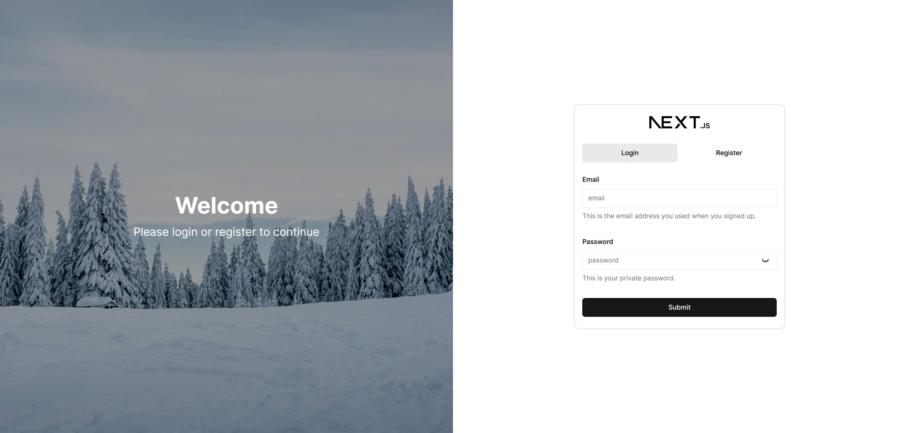
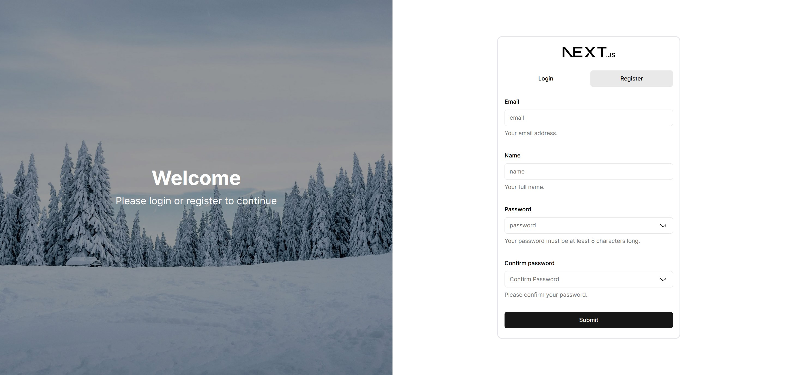

# Next.js Auth Template


## Description

A template for a Next.js application with authentication using Auth.js, Prisma ORM with PostgreSQL, and TypeScript. This
template is a starting point for building applications that require user authentication and a database. Avatars are
provided by Gravatar.

## Table of Contents

- [Installation](#installation)
- [Usage](#usage)
- [Features](#features)
- [Contributing](#contributing)
- [License](#license)
- [Contact](#contact)

## Installation

1. Clone the repository:
    ```
    git clone https://github.com/raeveira/next-auth-template.git
    ```
2. Navigate to the project directory:
    ```
    cd next-auth-template
    ```
3. Install dependencies:
    ```
    npm install
    ```
4. Copy the `.env.example` file to `.env.local` and fill in the required values:
    ```
    cp .env.example .env
    ```
5. Initialize the database:
    ```
    npx prisma migrate dev
    ```
6. Start the development server:
    ```
    npm run dev
    ```
7. Open your browser and navigate to `http://localhost:3000`

## Usage

Provide instructions and examples for using your project. Include code snippets where necessary.

```typescript jsx
import React from 'react';

const App: React.FC = () => {
    return (
        <div>
            <h1>Welcome to Next.js Auth Template!</h1>
            <p>This is a template for building applications with authentication and a database.</p>
        </div>
    );
};

export default App;
```

## Features

- Authentication with [Auth.js](https://authjs.dev/)
- Prisma ORM with PostgreSQL [Prisma](https://www.prisma.io/) [PostgreSQL](https://www.postgresql.org/)
- TypeScript with Next.js [TypeScript](https://www.typescriptlang.org/) [Next.js](https://nextjs.org/)

## Contributing

1. Fork the repository
2. Create your feature branch:
    ```
    git checkout -b feature/your-feature
    ```
3. Commit your changes:
    ```
    git commit -m 'Add some feature'
    ```
4. Push to the branch:
    ```
    git push origin feature/your-feature
    ```
5. Open a pull request

## License

This project is licensed under the MIT License - see the `LICENSE` file for details.

## Contact

Raeveira - [info@raeveira.nl](mailto:info@raeveira.nl)

Project Link: [https://github.com/raeveira/next-auth-template](https://github.com/raeveira/next-auth-template)

## Screenshots



